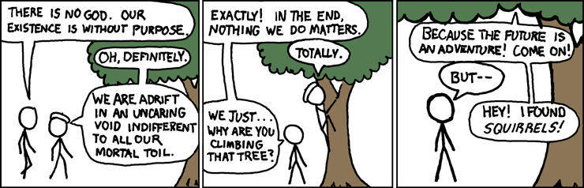

  

    

    

      <b>404-Page does not exist in this particular universe</b> 
      If this is a broken link <a href="mailto:sreemanmohanreddy@gmail.com">send a mail</a>, I will fix it. 
      If you are too bored following links may be useful. 
      <a href="https://arxiv.org/list/gr-qc/new">gr-qc</a> |
      <a href="https://arxiv.org/list/hep-th/new">hep-th</a>|
      <a href="https://animekaizoku.com/">Animekaizoku</a> |
      <a href="https://inspirehep.net/literature?sort=mostcited&size=25&page=1&q=">Most cited HEP</a> |
      <a href="http://libgen.is/">LibGen</a>
        
      If you are feeling that life is meaning less as in <a href="https://en.wikipedia.org/wiki/Existential_nihilism">Existential nihilism</a> see the below meme and chill out 
      
    

  

